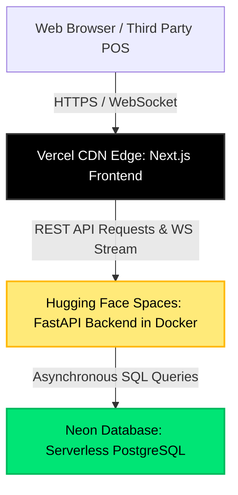
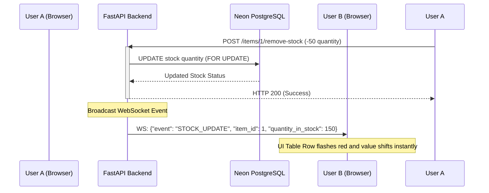

# 🏗️ System Architecture: Universal Stock API

This document details the high-level architecture, design decisions, database operations, and deployment workflow for the **Universal Stock API** system.

---

## 1. High-Level Architecture Topology

The application utilizes a distributed cloud architecture (*multi-cloud system*) optimized for fast edge performance, high data availability, and zero hosting costs.



### Components:
1.  **Frontend Dashboard (Next.js 15+ & React 19):**
    *   Hosted on **Vercel** for fast edge page delivery and global CDN caching.
    *   Acts as the administrative and operational control deck.
2.  **Backend API Engine (FastAPI):**
    *   Hosted on **Hugging Face Spaces** running as a Dockerized container (exposed on port `7860`).
    *   Leverages asynchronous ASGI workers to handle high levels of concurrent requests.
3.  **Relational Storage (PostgreSQL):**
    *   Hosted on **Neon Database** using serverless configurations.
    *   All connections enforce SSL/TLS encryption.

---

## 2. Separation of Concerns (Layered Architecture)

The backend code enforces a strict layered pattern to divide responsibilities, keep code clean, and facilitate testing:

*   **`app/api/v1/routes/` (Routing Layer):** Receives HTTP requests, validates request payloads using Pydantic, delegates operations to the business service layer, and shapes the HTTP response.
*   **`app/api/v1/dependencies.py` (Dependency Injection):** Handles authentication checking, parses JWT credentials, extracts API keys, and manages database session handouts.
*   **`app/services/` (Business Logic Layer):** Houses the core business rules (e.g., verifying item limits, validation of transaction permissions, calling aggregations). Coordinates with repositories for data operations.
*   **`app/repositories/` (Data Access Layer):** Direct queries to the database using SQLAlchemy 2.0 async paradigms. This is the only layer allowed to compile SQL commands.
*   **`app/models/` (Data Representation):** Declares database schemas (SQLAlchemy base models) and data transfer objects (Pydantic validation schemas).
*   **`app/core/` (Security & Middleware):** Houses shared concerns like exceptions handlers, rate-limiting rules, CORS config, and JWT encryptors.

---

## 3. Concurrency Safety: Row-Level Locking

One of the critical challenges in inventory management is preventing **race conditions** (e.g., two users removing stock from the same item simultaneously, resulting in incorrect calculations or negative stock values).

To resolve this asynchronously without locking the entire application thread, we implement database **Row-Level Locking** (`FOR UPDATE`):

```python
# app/repositories/item_repository.py
# Execute select query using WITH FOR UPDATE to lock the specific row
stmt = select(Item).where(Item.id == item_id).with_for_update()
res = await self.session.execute(stmt)
item = res.scalar_one_or_none()
```

### Locking Process:
1.  **Request Arrival:** A request to subtract stock (e.g., `-50`) arrives.
2.  **Row Locking:** FastAPI locks the item row in Neon PostgreSQL (`SELECT ... FOR UPDATE`).
3.  **Process Queue:** If another request arrives for the same item ID, its transaction pauses at the database level until the first transaction calls `COMMIT` or `ROLLBACK`.
4.  **Safe Write:** Stock subtraction calculations are performed, written to database storage, and then unlocked safely.

---

## 4. Real-time Synchronization (WebSockets)

WebSocket protocols are used to propagate state changes instantly across multiple open browsers without triggering manual browser reloads.



*   **Broadcast Manager:** The backend keeps an active memory of connected WebSocket connections mapped to user identities.
*   **Visual Feedback:** The client listens for `STOCK_UPDATE` events. Upon receipt, React updates local states, causing the inventory table row to emit a brief CSS flash animation (green for `IN`, red for `OUT`).

---

## 5. Deployment Workflow: DUAL-PUSH SYNC

Because the frontend and backend are deployed on separate cloud providers, **it is critical to update both remotes when making backend changes to prevent API desync.**

If the backend repository is not synced with Hugging Face, the Vercel frontend will call endpoints that do not exist (HTTP 429 or 404), resulting in broken features or blank dashboard pages.

### Recommended Git Deploy Sequence:

When updating the backend codebase or schemas:

```bash
# 1. Add and commit your changes
git add .
git commit -m "feat: your new feature"

# 2. Push to GitHub (This automatically builds & deploys the Vercel Frontend)
git push origin main

# 3. Push to Hugging Face Spaces (This builds & deploys the FastAPI Backend container)
git push hf main
```

> [!WARNING]
> Hugging Face requires about 1 to 2 minutes to build the updated Docker container from your push. During this short period, the online backend might experience a brief cold start or API downtime.
