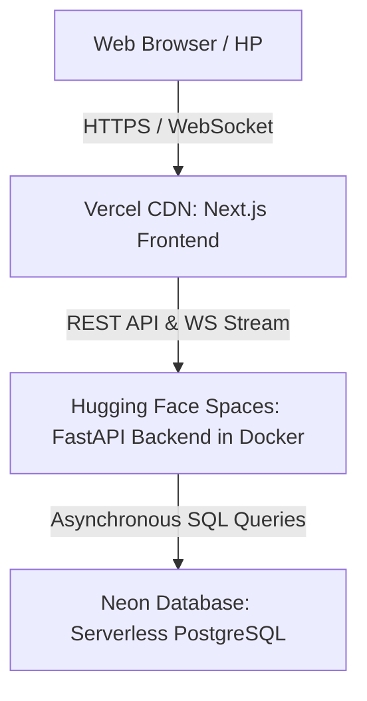

# 📖 Buku Panduan Proyek: Universal Stock API
### Panduan Pengembang (Developer Guide & Best Practices)

Buku panduan ini dibuat khusus untuk membantu programmer junior, pengembang baru, atau bahkan Anda sendiri di masa depan agar dapat memahami, menjalankan, dan mengembangkan sistem **Universal Stock API** ini tanpa bingung.

---

## 1. Gambaran Umum & Topologi Sistem

Proyek ini adalah sistem manajemen stok barang (inventory) tingkat enterprise yang terbagi menjadi dua bagian utama (*monorepo*):
1. **Backend (Server API):** Dibuat menggunakan **FastAPI** (Python).
2. **Frontend (Dashboard UI):** Dibuat menggunakan **Next.js** (TypeScript, React 19).

### Bagaimana Sistem Ini Saling Terhubung?

* **Database (Neon PostgreSQL):** Tersimpan di server cloud Neon. Semua data stok, transaksi, kategori, dan user tersimpan di sini.
* **Server Backend (Hugging Face):** Menjalankan program Python FastAPI di dalam container Docker. Bertugas memproses data, autentikasi, dan memancarkan data real-time.
* **Client Frontend (Vercel):** Menampilkan halaman dasbor interaktif yang bisa diakses user melalui browser HP atau Laptop.

---

## 2. Mengenal Tech Stack & Alasan Penggunaannya

Berikut adalah teknologi yang digunakan dalam proyek ini dan alasan mengapa teknologi tersebut dipilih:

### A. FastAPI (Python)
* **Mengapa?** Sangat cepat, modern, dan mendukung pemrograman asinkronus (`async/await`) secara bawaan. Ini membuat server mampu menangani ribuan koneksi WebSocket real-time secara bersamaan tanpa lag.

### B. Next.js 15+ & React 19 (TypeScript)
* **Mengapa?** Next.js memudahkan routing halaman secara otomatis dan mendukung optimalisasi performa. TypeScript digunakan agar tipe data terpantau ketat sejak awal, meminimalisir bug saat mengetik kode.

### C. Neon PostgreSQL (Serverless) & SQLAlchemy 2.0 (Async)
* **Mengapa?** PostgreSQL adalah database relasional standar industri yang sangat kuat. SQLAlchemy 2.0 digunakan sebagai ORM (Object-Relational Mapping) dengan gaya penulisan asinkron murni agar kueri database tidak menghalangi (*blocking*) proses utama server.

### D. WebSockets Protocol
* **Mengapa?** Memungkinkan server mengirimkan pembaruan stok secara instan ke browser tanpa browser harus melakukan refresh halaman secara manual (sinkronisasi real-time dua arah).

---

## 3. Struktur Folder Proyek

Pahami letak file-file penting agar Anda tidak salah menaruh kode baru:

```text
universal_stock_api/
│
├── app/                      <-- [BACKEND CODING]
│   ├── api/v1/
│   │   ├── routes/           <-- Endpoint API (Router)
│   │   └── dependencies.py   <-- Validasi Login JWT & API Key
│   ├── core/                 <-- Pengaturan global, rate limiter, & exception handlers
│   ├── models/               <-- Skema tabel database (SQLAlchemy) & Pydantic
│   ├── repositories/         <-- Layer akses database (Semua query SQL/CRUD di sini)
│   ├── services/             <-- Bisnis Logika (Validasi stok, perhitungan, dll)
│   ├── database.py           <-- Koneksi database
│   └── main.py               <-- Entrypoint utama aplikasi FastAPI
│
├── frontend/                 <-- [FRONTEND CODING]
│   ├── app/                  <-- Halaman dasbor Next.js (App Router)
│   │   ├── (dashboard)/      <-- Halaman internal setelah login (dashboard, inventory, dll)
│   │   ├── login/            <-- Halaman login
│   │   └── register/         <-- Halaman registrasi
│   ├── components/           <-- Komponen UI (Sidebar, dll)
│   └── context/              <-- State global (WebSocket context untuk live update)
│
├── scripts/                  <-- [SCRIPT UTILITAS]
│   ├── seed_test_db.py       <-- Mengisi database awal untuk pengujian
│   └── manage_users.py       <-- Alat CLI kelola user (reset password, role, dll)
│
├── ADMIN.md                  <-- Panduan cara pakai script kelola user
├── ARCHITECTURE.md           <-- Dokumentasi teknis arsitektur sistem
├── DESIGN.md                 <-- Spesifikasi token warna UI & Glassmorphism
└── JUNIOR_GUIDE.md           <-- File ini (Buku panduan proyek)
```

---

## 4. Langkah Menjalankan Proyek secara Lokal (Development)

Jika Anda ingin menjalankan atau menguji proyek ini di komputer lokal Anda:

### A. Menjalankan Backend (Server)
1. Masuk ke folder root proyek dan aktifkan virtual environment Python Anda:
   ```bash
   # Di Windows (PowerShell)
   .venv\Scripts\Activate.ps1
   ```
2. Pastikan file `.env` di root sudah berisi kredensial database lokal Anda.
3. Jalankan server FastAPI:
   ```bash
   uvicorn app.main:app --reload --port 8000
   ```
   *Server backend lokal akan berjalan di `http://127.0.0.1:8000`.*

### B. Menjalankan Frontend (Client)
1. Buka terminal baru dan masuk ke folder `frontend`:
   ```bash
   cd frontend
   ```
2. Jalankan server Next.js:
   ```bash
   npm run dev
   ```
   *Dashboard lokal akan berjalan di `http://localhost:3000`.*

---

## 5. Aturan Penting: Apa yang WAJIB Dilakukan (DOs)

Selalu ikuti standar penulisan kode berikut saat memodifikasi proyek ini:

1. **Selalu Gunakan Async/Await di Python:**
   Semua endpoint di router, fungsi di service, dan query di repository **wajib** menggunakan `async def` agar tidak memblokir server utama.
2. **Gunakan SQLAlchemy 2.0 Async Style:**
   Gunakan perintah `select(...)` dan eksekusi via `await session.execute(...)` (Gaya 2.0). Jangan pernah menggunakan pola lama `session.query(Model)`.
3. **Pemisahan Layer yang Ketat:**
   * Jangan menulis query database langsung di dalam Router/Endpoint. Letakkan kueri tersebut di layer **Repository**.
   * Jangan melakukan perhitungan bisnis rumit di dalam Router. Letakkan di layer **Service**.
4. **Gunakan Global Exception (`AppException`):**
   Jika ingin memicu error di layer Service atau Repository, gunakan exception kustom seperti `raise AppException(...)` dari `app.core.exceptions`. Ini akan ditangkap secara otomatis oleh handler global agar format error JSON di browser tetap rapi dan standar.
5. **Gunakan Dual-Push saat Deployment:**
   Karena frontend (Vercel) dan backend (Hugging Face) terpisah, setiap kali Anda selesai melakukan perubahan kode backend, Anda **wajib mem-push ke kedua remote**:
   ```bash
   git push origin main  # Deploy Frontend ke Vercel
   git push hf main      # Deploy Backend ke Hugging Face
   ```
6. **Bungkus Tabel dengan Wrapper Scrollable:**
   Di frontend, pastikan semua elemen tabel dibungkus menggunakan div dengan kelas `.table-container` atau `.table-responsive-container` agar tabel bisa di-scroll secara horizontal di layar HP tanpa merusak lebar layout dasbor.

---

## 6. Aturan Penting: Apa yang TIDAK BOLEH Dilakukan (DON'Ts)

Hindari kesalahan-kesalahan fatal berikut ini:

1. **JANGAN PERNAH menyimpan Password Teks Biasa (Plain Text) di Database:**
   Semua password harus melalui fungsi `hash_password` sebelum disimpan. Hal ini mutlak demi keamanan user.
2. **JANGAN PERNAH mengunggah File Kredensial Lokal ke GitHub:**
   Pastikan file sensitif seperti `.env` dan `.env.production.local` terdaftar di `.gitignore`. Jangan pernah menghapus entri ini agar password database Neon DB Anda tidak bocor ke publik.
3. **JANGAN menggunakan Dependency Blocking di Backend:**
   Hindari pemakaian library Python yang berjalan secara sinkron (blocking) seperti `requests` di dalam async endpoints. Gunakan `httpx` (async) sebagai gantinya jika ingin melakukan HTTP request eksternal.
4. **JANGAN merusak Viewport Dasbor di Mobile:**
   Jangan menggunakan nilai lebar pixel tetap yang besar (misalnya `width: 800px`) secara mentah tanpa media query. Gunakan persentase (`width: 100%`) atau CSS Grid/Flexbox agar tampilan otomatis menyesuaikan di layar HP.
5. **JANGAN melakukan Mutasi Stok tanpa Lock Database:**
   Saat mengurangi atau menambah stok, selalu gunakan row-level locking (`.with_for_update()`) pada query select item untuk mencegah *race conditions* (dua pengguna meng-update barang yang sama di mili-detik yang sama).

---

## 7. Cara Memanfaatkan Script Pembantu (Utilitas)

Dua script penting di folder `scripts/` sangat berguna untuk operasional:

### A. Melakukan Database Seeding
Jika database kosong atau Anda baru saja mereset database lokal/produksi, gunakan ini untuk mengisi data kategori dan barang awal agar Playwright test bisa berjalan:
```bash
python scripts/seed_test_db.py
```

### B. Mengelola User Database (Lokal & Produksi)
Gunakan alat CLI `scripts/manage_users.py` untuk mengaudit akun tanpa perlu masuk ke console PostgreSQL secara manual:
* **Melihat user lokal:** `python scripts/manage_users.py list`
* **Melihat user produksi (Neon DB):** `python scripts/manage_users.py list --prod`
* **Mereset password user produksi:** `python scripts/manage_users.py reset <email> <password_baru> --prod`
* **Mengubah peran user produksi:** `python scripts/manage_users.py role <email> <admin|user> --prod`
* **Memblokir/Mengaktifkan user produksi:** `python scripts/manage_users.py status <email> <activate|deactivate> --prod`

---

*Dengan mematuhi buku panduan ini, proyek Universal Stock API akan selalu berjalan dengan stabil, aman, dan mudah dipelihara oleh siapa pun! Selamat berkoding!*
